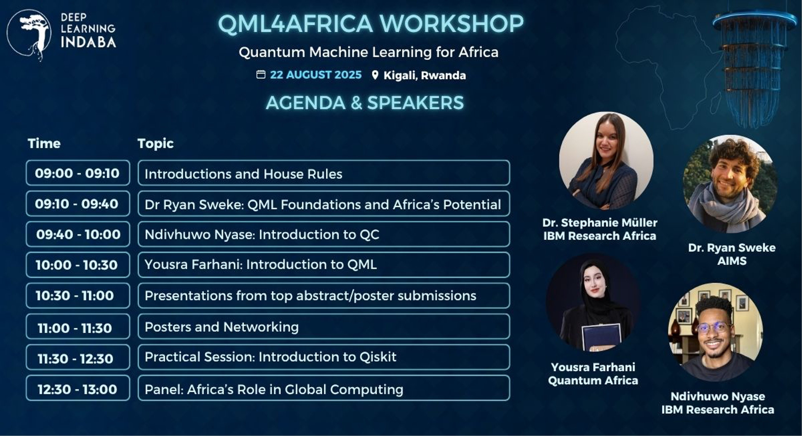
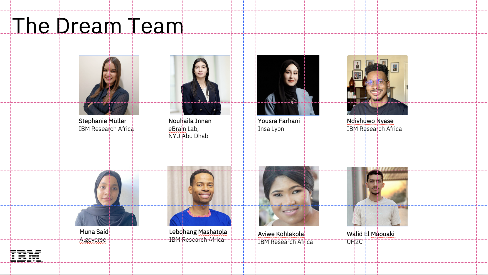

# QML4Africa Workshop

Welcome to the QML4Africa workshop at Deep Learning Indaba in Rwanda, Kigali! This hands‑on series will introduce you to quantum computing, and quantum machine learning (QML) concepts and practical coding exercises using Qiskit and related quantum tools. Please start with the getting started notebook.

Hosts: Ndivhuwo Nyase, Yoursa Farhani, Stephanie Muller, Nouhaila Innan, Muna Said, Lebohang Mashatola, Aviwe Kohlakola, Walid El Maouaki
Date: 21 August 2025, Friday
Time: 10:00 - 14:00
Place: Deep Learning Indaba 2025 Rwanda, Kigali  (Deep Learning Indaba Rwanda, Kigali)
Room: Kivu Tents





## Table of Contents

1. [Introduction](#introduction)
2. [Prerequisites](#prerequisites)
3. [Setup & Installation](#setup--installation)
4. [Workshop Structure](#workshop-structure)
5. [Exercise 1: Getting Started](#exercise-1-getting-started)
   - [1.1 Superposition](#11-superposition)
   - [1.2 Bell State](#12-bell-state)
   - [1.3 GHZ State](#13-ghz-state)
7. [Exercise 3: Quantum Machine Learning](#qml)

---

## Introduction

Quantum Computing harnesses quantum mechanics including superposition, entanglement, and interference to perform computations beyond classical limits. Quantum Machine Learning (QML) blends these quantum computing principles with machine learning to tackle problems that are intractable on classical systems. Over this workshop, you'll learn how to build, simulate, and run simple quantum circuits using Qiskit, culminating in basic QML models.

## Prerequisites

- **Python <=3.11+** installed
- **Conda** or **virtualenv** recommended
- **Git** for cloning repos
- Basic familiarity with Python programming

## Setup & Installation

1. Clone the workshop repository:
   ```bash
   git clone #need to complete
   cd QML4Africa
   ```
2. Create and activate a virtual environment:
   ```bash
   conda create -n qml4africa python=3.12
   conda activate qml4africa
   ```
3. Install required packages:
   ```bash
   pip install -r requirements.txt
   ```
4. Open `getting_started.ipynb` to begin.


First you must check that the version of python you are using in your environment is python>=3.9.6, to make sure that it will be compatible with the latest Qiskit version we will use

Furthermore, you can also find many useful resources on IBM's new page of quantum education [IBM Quantum Learning](https://learning.quantum.ibm.com/).

This notebook will guide you through the setup process on the IBM Quantum Platform where you will be granted 10 mins a month to utilize and code on actual quantum hardware.

If that is not your case, you can upgrade it using your preferred tool. If you are unsure about how to do it, some recommended options are:

- MacOS: [Homebrew](https://brew.sh/)
- Windows: [Chocolatey](https://chocolatey.org/install)
- Linux: `sudo apt-get update `


A detailed guide on how to do it depending on your OS is detailed here: [How to update python](https://4geeks.com/how-to/how-to-update-python-version)

## Troubleshooting <a id="troubleshooting"></a>

If the previous cell raised any error, you can opt to install Qiskit in a virtual environment. Otherwise, you can ignore this cell and proceed to the next one.

Here we propose two different methods to set up a virtual environment to install Qiskit.
1. Using [venv](https://docs.python.org/3/library/venv.html), as explained in the [Qiskit installation guide](https://docs.quantum.ibm.com/guides/install-qiskit). 
2. Using [conda](https://docs.conda.io/projects/conda/en/latest/user-guide/install/index.html), as explained in this video of [Coding with Qiskit](https://www.youtube.com/watch?v=93-zLTppFZw&list=PLOFEBzvs-VvrgHZt3exM_NNiNKtZlHvZi&index=4).

Both methods are respectively detailed in the Qiskit links provided.

## Workshop Structure

In this workshop You will:

- Understand basic quantum concepts like superposition
- Explore fundamental quantum gates, circuits and explore the bloch sphere.
- Simulate on Aer simulators and run on IBM Quantum hardware
- Progress to simple QML models using the IRIS dataset by the end of the series

## Exercise 1: Getting Started

In this first exercise, you will build foundational quantum circuits:

### 1.1 Superposition

- **Objective:** Prepare a single qubit in an equal superposition of |0⟩ and |1⟩.
- **Steps:**
  1. Create a 1-qubit circuit with 1 classical bit.
  2. Apply the Hadamard gate (`H`) to qubit 0.
  3. Measure the qubit into the classical bit.
  4. Simulate with 1024 shots and plot the histogram of outcomes (expect \~50% 0 and 50% 1).

### 1.2 Bell State

- **Objective:** Entangle two qubits to form a Bell (EPR) pair.
- **Steps:**
  1. Create a 2-qubit circuit with 2 classical bits.
  2. Apply `H` to qubit 0.
  3. Apply `CX` (CNOT) from qubit 0 → qubit 1.
  4. Measure both qubits and visualize the histogram (expect `00` and `11` only).

### 1.3 GHZ State

- **Objective:** Extend entanglement to three qubits, creating a GHZ state.
- **Steps:**
  1. Create a 3-qubit circuit with 3 classical bits.
  2. Apply `H` to qubit 0.
  3. Apply `CX` from qubit 0 → qubit 1, then `CX` from qubit 1 → qubit 2.
  4. Measure all qubits and plot (expect `000` and `111`).


## Exercise 2: Introduction to the QML using IRIS dataset

  In this exercise, we will demonstrate quantum computing and machine learning (ML) concepts explored during conference and help participants to consolodate their knowledge of QML. Using a quantum machine learning model we will predict the iris dataset.

3.1 Loading Classical Data onto a Quantum Circuit
3.2 Apply the Quantum Neural Network or Ansatz


- **Resources:**
  - Qiskit Documentation: [https://qiskit.org/documentation](https://qiskit.org/documentation)
  - IBM Quantum Experience: [https://quantum-computing.ibm.com](https://quantum-computing.ibm.com)

Happy quantum computing! 🚀

